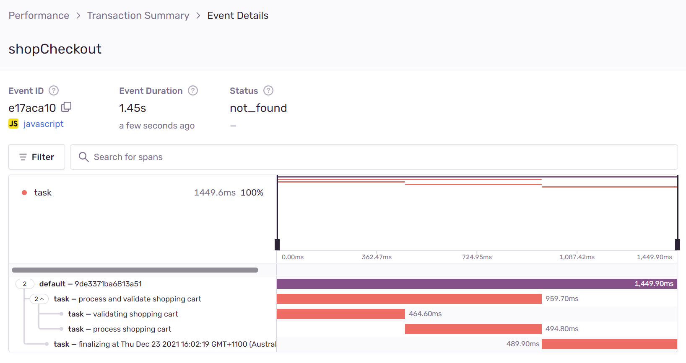

# Sentry custom transaction example

Example project to showcase usage of custom transactions in Sentry for performance analytics

## Getting started

1. `git clone https://github.com/Maxim-Mazurok/sentry-custom-transaction-example`
2. `cd sentry-custom-transaction-example`
3. `npm ci`
4. `echo "SENTRY_DSN=your_sentry_dsn_goes_here" > .env` (see also [.env.example](./.env.example))
5. `npm start`
6. Click "Shop Checkout" button, it'll perform two tasks with random durations, and will also sometimes randomly fail one of them, see your Performance > All Events list on Sentry

